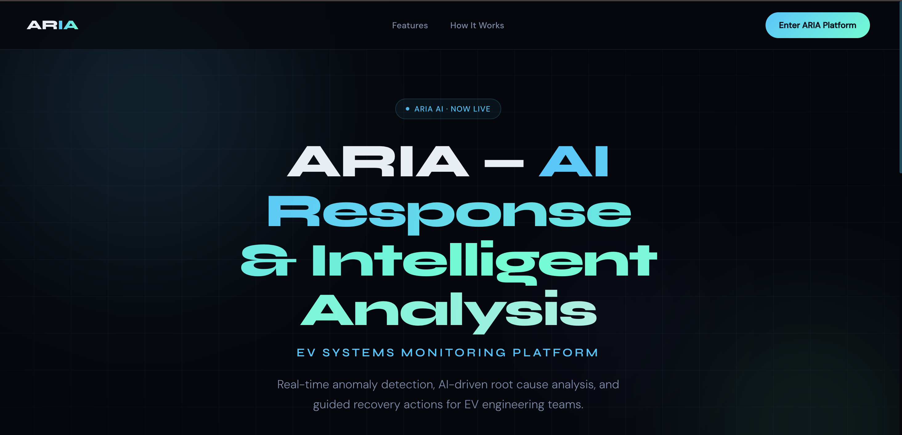
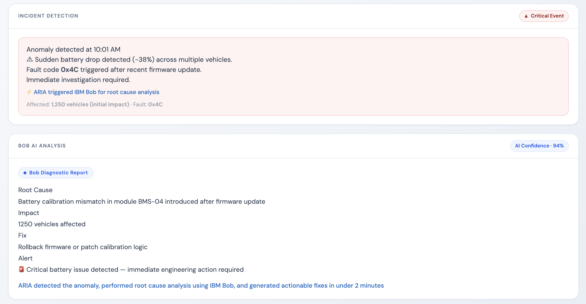
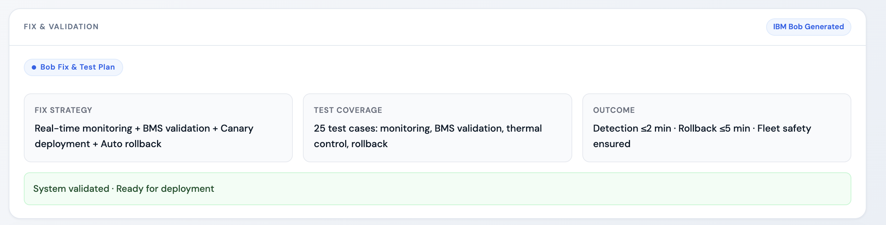
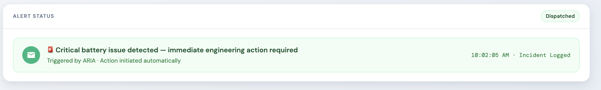

ARIA — EV Battery Failure Intelligence System
Overview

ARIA (AI Response and Intelligent Analysis) is a real-time monitoring and analysis system designed to detect, analyze, and respond to electric vehicle (EV) battery anomalies. It transforms raw telemetry and log data into actionable insights, enabling faster decision-making and improved fleet reliability.

Problem

Modern EV fleets generate large volumes of telemetry data through battery management systems (BMS). However, failures caused by firmware updates, calibration mismatches, or system inconsistencies are often difficult to detect early.

These issues can lead to:

Sudden battery drops
Thermal risks and overheating
Charging inefficiencies
Large-scale impact across fleets

Traditional analysis requires engineers to manually inspect thousands of log entries, leading to delays, increased risk, and higher operational costs.

Solution

ARIA automates EV battery failure detection and analysis using an AI-driven pipeline:

Detect → Analyze → Resolve → Alert

Detects anomalies from incoming telemetry data
Performs AI-powered root cause analysis
Generates actionable fix recommendations
Creates validation and testing strategies
Sends real-time alerts to engineering teams

In our demo scenario, ARIA detects a sudden battery drop affecting 1,250 vehicles and identifies the root cause within minutes.

Key Features
Real-time EV battery anomaly detection
AI-driven root cause analysis
Interactive dashboard visualization
Automated fix and test recommendations
Scalable architecture for fleet monitoring
Technology Stack
Backend: FastAPI (Python)
Frontend: HTML, CSS, JavaScript
AI Development: IBM Bob
AI Analysis: IBM watsonx.ai (LLaMA-based models)
IBM Bob Usage

IBM Bob was used throughout the development lifecycle to accelerate and structure the project.

It was utilized for:

Generating backend APIs and application logic
Designing system architecture and workflow
Debugging and refining implementation
Structuring AI-driven outputs such as root cause analysis, fix recommendations, test strategies, and alerts

ARIA integrates with IBM watsonx.ai, where LLaMA-based models are used to analyze telemetry data and produce structured insights.

All Bob task sessions, including screenshots and exported task-history reports, are provided in the bob_sessions/ folder as required by the hackathon guidelines.

Bob was used across multiple task sessions to build, debug, and validate the complete system.

Project Structure
aria-project/
├── backend/
├── frontend/
├── src/
├── data/
├── docs/
├── bob_sessions/
├── README.md
└── requirements.txt
How to Run the Project
Prerequisites

Make sure you have:

Python 3.10+
pip (Python package manager)
Git (optional)
1. Clone the Repository
git clone https://github.com/bhavanarasamsetti/aria-project.git
cd aria-project
2. Create Virtual Environment (Recommended)
python3 -m venv .venv
source .venv/bin/activate   # Mac/Linux
3. Install Dependencies
pip install -r requirements.txt
4. Configure Environment Variables

Create a .env file in the root folder:

WATSONX_API_KEY=your_api_key
WATSONX_PROJECT_ID=your_project_id
USE_WATSONX_API=true

If you don’t have API access, use:

USE_WATSONX_API=false
5. Run the Backend Server
cd backend
uvicorn main:app --reload
6. Open the Dashboard

Go to:

http://127.0.0.1:8000/dashboard
7. Run in Demo Mode (Optional)

If API is disabled:

The system will simulate realistic outputs
You can still view anomaly detection, analysis, and alerts
## Screenshots

### Landing Page

### IBM Bob AI Analysis

### Fix & Validation

### Alert Status

Demo

A demo video (≤ 3 minutes) showcasing the problem, solution, and system workflow is included in the submission.

Impact

ARIA reduces failure detection and analysis time from hours to under two minutes, enabling faster response, improved safety, and increased reliability in EV fleet operations.

Authors
Bhavana Rasamsetti — AI Analysis, Root Cause Engine, Dashboard.

Deepika Rasamsetti — Fix Recommendations, Test Generation, Validation.

Note

API keys and sensitive credentials are not included in this repository for security reasons.
